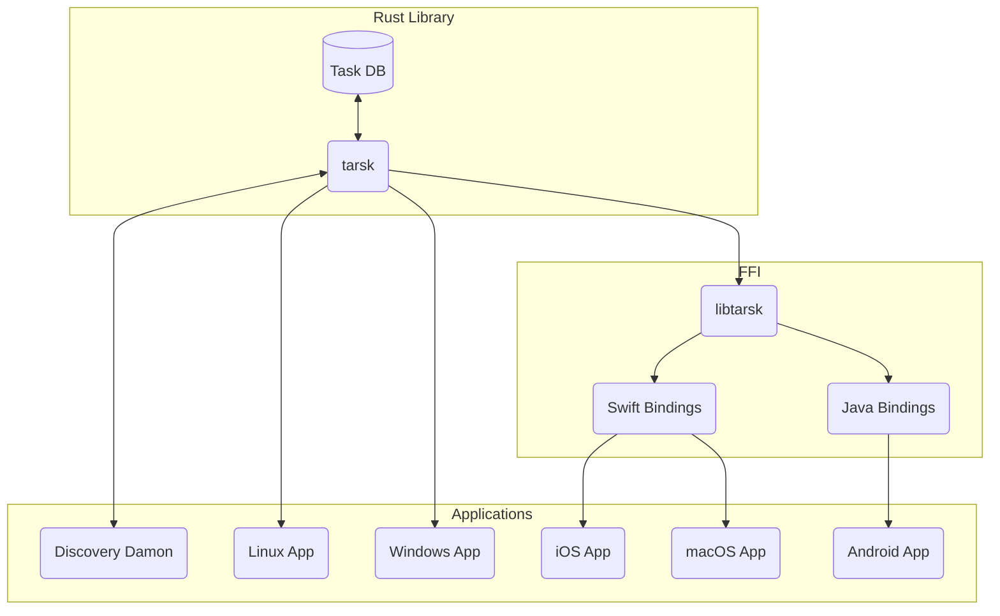

# tarsk

**This is pre-alpha vaporware. There are no stability guarantees :)**

A CRDT-based task management software
based on [automerge-rs](https://github.com/automerge/automerge-rs)
built for an offline-first workflow.

## Why?

There are already myriad task management solutions available,
why build another?
From anecdotal experience,
you typically get a choose two:

- Extensible
- Cross-platform
- Synchronized

[org-mode](https://orgmode.org/) is extensible and cross-platform
but it's difficult to synchronize across devices.
You can dump your `.org` files into some cloud storage solution,
but then you are synchronizing at the file level, rather than the task level.
What happens when you edit a task across two devices before they can connect to the internet?
Bad stuff!

[Things](https://culturedcode.com/things/),
on the other hand,
is cross-platform and synchronized,
but it isn't extensible.
It is closed source and doesn't have a toolkit
whereby users can add new features to the program.

[Notion](https://notion.so) is ostensibly a contender.
It's extensible (you can build your own task management workflow),
it's cross-platform (macOS, Windows, Linux, iOS, Android),
and it's synchronized.
But it's closed-source, for-profit, and leans heavily into server-based synchronization.
You can lose your authentication token if you haven't signed in for a long enough amount of time
and then you can't access your data until you next sign in!

This project aims to be a response to this conundrum by:

- Being proudly open-source and extensible!
  I'd like to let people change features by contributing upstream
  or one day using WASM-based plugins.

- Exposing a C FFI which can be integrated into native UIs
  across macOS, Windows, Linux, and mobile platforms.
  (Even though there's [no such thing as a native GUI](https://raphlinus.github.io/xi/2020/06/27/xi-retrospective.html))

- Building with CRDTs from the bottom up
  to provide rich synchronization across devices,
  both to live edits and to offline changes
  which are synchronized much more infrequently.

## Vision

- A central Rust library, which provides:
  - A CRDT-based central database (through automerge-rs).
  - A core representation of task data structures.
  - Morphisms on tasks which get committed to the central database.
  - Core networking features:
    - Peer discovery through a discovery daemon.
    - Synchronization over the network with peers.
- A discovery server:
  - Which binds to a well known port.
  - Accepts requests to register an IP address as a peer.
    - For local instances: instances of tarsk will attempt to register with this server.
    - For remote instances: share sets of peers with remote hosts.
    - _TODO:_ what about proxying sync requests to the discovery server
      so that you don't have to open a bunch of random ports?
  - Scans local networks for peers to connect to.
- A C library which:
  - Exposes a _start_-ish method to kick off the sync server.
  - Exposes an interface to perform morphisms on tasks.
  - Exposes an interface to query the state of tasks.
- FFI bindings:
  - To Swift for Apple ecosystem.
  - To Java for Android ecosystem.
- UI applications:
  - From Rust library:
    - Linux app
    - Windows app
  - From Swift bindings:
    - iOS app
    - macOS app
  - From Java bindings:
    - Android app

## License

MIT Open Source
